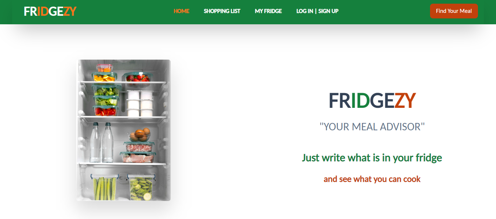

# Fridgezy

Fridgezy is a web application that helps users make the most out of the ingredients available in their fridge. It provides suggestions, tips, and recipes based on the ingredients provided, as well as highlights missing ingredients for specific meals and unused ingredients. The app also offers authentication features to save recipes, and in the future, it will include image upload and image recognition capabilities. Additionally, Fridgezy will introduce two upcoming features: shopping list and my fridge.

## Features

- **Ingredient-Based Suggestions**: Users can input the ingredients they have in their fridge and receive suggestions and recipes based on those ingredients.
- **Missing Ingredients**: Fridgezy identifies the missing ingredients needed for a specific recipe and provides recommendations for completing the dish.
- **Unused Ingredients**: The app suggests recipes and ideas for using up unused ingredients to reduce food waste.
- **Authentication (Upcoming)**: Users can create accounts, log in, and save their favorite recipes for future reference.
- **Image Upload (Upcoming)**: Users will be able to upload images of dishes they want to cook, and the app will provide recipes based on the uploaded image.
- **Image Recognition (Upcoming)**: Fridgezy will utilize image recognition technology to analyze images of ingredients in the user's fridge and suggest recipes based on those ingredients.
- **Shopping List (Upcoming)**: Users will be able to create and manage a shopping list within the app, making it easier to note the ingredients they need to buy.
- **My Fridge (Upcoming)**: Fridgezy will introduce a feature that allows users to save the contents of their fridge, enabling them to view and manage their inventory whenever they open the app.

## Technologies Used

- React.js: JavaScript library for building the user interface.
- Tailwind CSS: Utility-first CSS framework for styling the application.
- Material-UI: React component library for UI elements and styling.
- Chakra UI: React component library for building accessible and customizable UI components.

## Getting Started

### Prerequisites

- Node.js: Make sure Node.js is installed on your machine.

### Installation

1. Clone the repository: `git clone <repository-url>`
2. Navigate to the project directory: `cd fridgezy`
3. Install dependencies: `npm install`

### Development

1. Start the development server: `npm start`
2. Open your browser and visit `http://localhost:3000` to access the app.

### Production Build

1. Generate a production build: `npm run build`
2. The optimized build files will be located in the `build` directory.

## Usage

1. Open the app in your browser.
2. Sign up or log in to your account (authentication feature).
3. Enter the ingredients you have in your fridge.
4. Explore the suggested recipes and tips.
5. Save your favorite recipes for future reference (authentication feature).
6. **Upcoming Feature**: Create and manage your shopping list to keep track of the ingredients you need to buy.
7. **Upcoming Feature**: Save the contents of your fridge and view/manage them whenever you open the app.

## Contributing

Contributions to Fridgezy are welcome! If you'd like to contribute, please follow these steps:

1. Fork the repository.
2. Create a new branch for your feature: `git checkout -b feature-name`
3. Implement your feature or bug fix.
4. Commit your changes: `git commit -m 'Add some feature'`
5. Push to the branch: `git push origin feature-name`
6. Submit a pull request detailing your changes.

## License

This project is licensed under the [MIT License](LICENSE).

## Acknowledgements

- [React.js](https://reactjs.org)
- [Tailwind CSS](https://tailwindcss.com)
- [Material-UI](https://mui.com)
- [Chakra UI](https://chakra-ui.com)

## Contact

For any inquiries or questions, please contact [tevfiksarlak@gmail.com].
